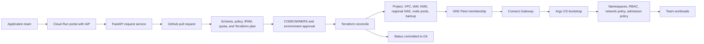

# GKE Cluster Factory

A runnable reference implementation for a self-service Google Kubernetes Engine cluster platform. Application teams request an approved cluster blueprint through a web portal. Git records the request, pull requests provide review and approval, Terraform provisions the Google Cloud resources, and Argo CD applies the Kubernetes baseline.

This repository supports two modes:

- **Local demonstration mode:** runs the portal and request workflow without Google Cloud access.
- **Production mode:** runs the portal on Cloud Run with Identity-Aware Proxy, stores requests in GitHub, authenticates CI through Workload Identity Federation, provisions GKE with Terraform, and bootstraps GitOps through the GKE Fleet Connect Gateway.

> **Delivery boundary:** the source code, validation suite, and local workflow are complete. No live Google Cloud apply was performed in this environment because organization credentials, billing, quotas, network ownership, H100 reservations, and approval policies are customer-specific. Run the included plan and preflight stages in your own Google Cloud organization before approving an apply.

## What is included

| Layer | Implementation |
|---|---|
| Self-service UI | Responsive HTML, CSS, and JavaScript portal served by FastAPI |
| API | FastAPI endpoints for catalog, validation, submission, and request status |
| Request contract | Pydantic models plus versioned YAML records in `requests/` |
| Policy engine | Blueprint, environment, availability, exposure, GPU, backup, and network checks |
| IPAM | Controlled node, Pod, Service, and control-plane pools with stable names and repository-wide collision checks |
| Approval | GitHub pull request with CODEOWNERS and protected environments |
| Infrastructure | Terraform for platform bootstrap, Cloud Run portal, projects, networking, GKE, IAM, KMS, Fleet, node pools, and backups |
| GKE security | Private regional control plane, private nodes, Dataplane V2, Workload Identity Federation, Shielded nodes, CMEK, Binary Authorization mode, Google Groups, and least-privilege node identity |
| H100 support | Dedicated tainted A3 node pool, GPU driver installation, reservation affinity, quota and reservation preflight |
| GitOps | Argo CD root application and a Helm baseline chart |
| Admission controls | Pod hardening, image digest and registry controls, required labels, production replicas, topology spread, resource controls, and Service exposure restrictions |
| Operations | Logging, Monitoring, Managed Service for Prometheus, Backup for GKE, status reconciliation, and guarded destruction |
| Delivery automation | Complete GitHub Actions workflow plus Cloud Build starter examples |
| Tests | Unit, API, request, IPAM, rendering, YAML, shell, JavaScript, Helm, and Terraform validation paths |

## Architecture



The requester supplies workload intent. The platform owns implementation details such as IP ranges, node identities, security settings, upgrade policy, and the GitOps baseline.

## Repository map

```text
app/                         Portal and API
config/                      Blueprint catalog and IPAM pools
requests/                    Git-backed desired state and status
terraform/bootstrap/         Platform project, state bucket, WIF, CI identity
terraform/factory-app/       Cloud Run portal secured with IAP
terraform/cluster/           Per-cluster Terraform root module
terraform/modules/           Network, GKE, and backup modules
gitops/bootstrap/            Argo CD root application template
gitops/charts/               Platform baseline Helm chart
gitops/examples/             Example H100 workload
scripts/                     Validation, rendering, preflight, status, bootstrap
.github/workflows/           CI, plan, apply, portal deployment, destroy
cloudbuild/                  Cloud Build starter equivalents
tests/                       Automated Python tests
docs/                        Architecture, deployment, security, and operations guides
```

## Run the portal locally

### Option A: Python

Requirements: Python 3.12 or newer.

```bash
cd gke-cluster-factory-reference-v1
python3 -m venv .venv
source .venv/bin/activate
pip install -r requirements-dev.txt
cp .env.example .env
uvicorn app.main:app --host 0.0.0.0 --port 8080
```

Open `http://localhost:8080`.

Local mode writes validated requests under `requests/<environment>/`. It does not call Google Cloud or run Terraform apply.

### Option B: Docker Compose

```bash
cp .env.example .env
# On Linux, set LOCAL_UID=$(id -u) and LOCAL_GID=$(id -g) in .env.
docker compose up --build
```

### Validate the included H100 request

```bash
python scripts/validate_request.py requests/prod/payments-ml-prod-usw1.yaml
python scripts/render_tfvars.py requests/prod/payments-ml-prod-usw1.yaml \
  --output /tmp/example-h100.tfvars.json
cat /tmp/example-h100.tfvars.json
```

## Production deployment sequence

1. Fork or copy this repository into the GitHub organization that will own the platform.
2. Replace the example Google Groups in `config/profiles.yaml` or provide real values through GitHub variables.
3. Configure the bootstrap variables in `terraform/bootstrap/terraform.tfvars`.
4. Apply `terraform/bootstrap` with an administrator identity.
5. Add a version of the portal GitHub token to the Secret Manager secret created by bootstrap.
6. Configure GitHub repository variables, secrets, environments, CODEOWNERS, and branch protection.
7. Deploy the portal through `.github/workflows/deploy-portal.yml`.
8. Submit a request through the portal.
9. Review the request and Terraform plan, then merge the pull request.
10. The reconciliation workflow provisions the cluster, connects through Fleet, installs Argo CD, applies the baseline, and records `READY` in Git.

The full command sequence is in [docs/deployment.md](docs/deployment.md).

## Required GitHub repository variables

| Variable | Purpose |
|---|---|
| `GCP_WORKLOAD_IDENTITY_PROVIDER` | Full Workload Identity provider resource name |
| `GCP_TERRAFORM_SERVICE_ACCOUNT` | Federated CI service account email |
| `TF_STATE_BUCKET` | GCS bucket for Terraform state |
| `PLATFORM_PROJECT_ID` | Project that hosts the factory |
| `GCP_REGION` | Factory region, default `us-west1` |
| `ARTIFACT_REPOSITORY` | Artifact Registry repository name |
| `PORTAL_INVOKER_GROUP` | Google Group allowed through Cloud Run IAP |
| `GKE_SECURITY_GROUP` | Cloud Identity group-of-groups for GKE Google Groups authentication |
| `PLATFORM_ADMIN_GROUP` | Google Group granted cluster administration by GitOps |
| `CREATE_CLUSTER_PROJECTS` | `true` when Terraform should create service projects |
| `CLUSTER_PROJECT_PARENT` | Parent such as `folders/123456789` |
| `BILLING_ACCOUNT` | Billing account used when projects are created |

## Required GitHub secrets

| Secret | Purpose |
|---|---|
| `ARGOCD_GIT_USERNAME` | Git username used by Argo CD for a private repository |
| `ARGOCD_GIT_TOKEN` | Read-only Git token used by Argo CD |

The portal GitHub token is stored in Google Secret Manager, not as a Cloud Run environment value. Use a fine-grained token or GitHub App credential with only the repository permissions required to read contents, create branches, write request files, and open pull requests.

## Required GitHub environments

Create these protected environments:

- `cluster-plan`
- `cluster-production`
- `cluster-destruction`
- `platform-production`

Require reviewers for plan, production, and destruction environments. Protect `main`, require pull requests, require branches to be current before merge, require the CI and plan checks, and require CODEOWNERS approval for production request files and platform code. The reconciliation workflows commit lifecycle status to `requests/`; configure a narrowly scoped ruleset bypass for GitHub Actions or replace the status push with an organization GitHub App.

## Supported blueprints

| Blueprint | Use case |
|---|---|
| `standard-dev-v1` | Regional development and test cluster |
| `standard-prod-v1` | Regional production cluster with HA defaults |
| `standard-prod-h100-v1` | Production cluster with an isolated reservation-backed H100 pool |

Blueprints are product versions. Change defaults by publishing a new blueprint version instead of silently changing existing contracts.

## Security and policy notes

- The portal uses Cloud Run IAP for browser authentication in production.
- The CI identity uses Workload Identity Federation, so a service-account key is not required.
- Cluster owners receive Fleet Connect Gateway access and namespace-scoped Kubernetes RBAC.
- Platform administrators receive cluster administration through the GitOps baseline.
- Application namespaces start with default-deny network policies.
- Production workloads require at least three replicas and zone topology spreading.
- Images must be digest-pinned and use an approved registry prefix in namespaces selected for strict policy.
- Binary Authorization evaluation is enabled on GKE, but this repository does not create an organization-specific signing authority or attestor. See [docs/binary-authorization.md](docs/binary-authorization.md).

## Validation commands

```bash
ruff check app tests scripts
pytest -q
python scripts/validate_request_set.py
./scripts/validate_all.sh
node --check app/static/app.js
```

When Terraform and Helm are installed:

```bash
terraform fmt -recursive -check terraform
for directory in terraform/bootstrap terraform/cluster terraform/factory-app; do
  terraform -chdir="$directory" init -backend=false
  terraform -chdir="$directory" validate
done
helm lint gitops/charts/platform-baseline
helm template platform-baseline gitops/charts/platform-baseline \
  --set cluster.name=ci \
  --set access.team=ci-team \
  --set access.ownerGroup=ci-team@example.com \
  --set access.platformAdminGroup=platform@example.com \
  --set gitops.repoURL=https://github.com/example/factory.git \
  --set environment=prod \
  --set workloadExposure=internal >/tmp/platform-baseline.yaml
```

## Important operating boundaries

- This is a strong production-oriented reference, not a substitute for your organization landing zone, threat model, compliance review, or change process.
- H100 quota, zone offering, reservation shape, and physical capacity must pass the live preflight before approval.
- A regional cluster survives a zone-level control-plane event, but this repository does not create a second-region disaster-recovery cluster.
- Workload data recovery must be tested through restore drills. A successful backup alone is not a recovery guarantee.
- Shared VPC firewall policy, DNS, hybrid routing, VPC Service Controls, SIEM routing, budgets, and organization policies usually belong in the broader landing zone and should be integrated rather than duplicated here.

## Documentation

- [Architecture](docs/architecture.md)
- [Deployment](docs/deployment.md)
- [Request schema](docs/request-schema.md)
- [Security model](docs/security.md)
- [Operations runbook](docs/operations.md)
- [Local demonstration](docs/demo.md)
- [Binary Authorization extension](docs/binary-authorization.md)
- [Validation record](VALIDATION.md)

## License

Apache License 2.0. See [LICENSE](LICENSE).
