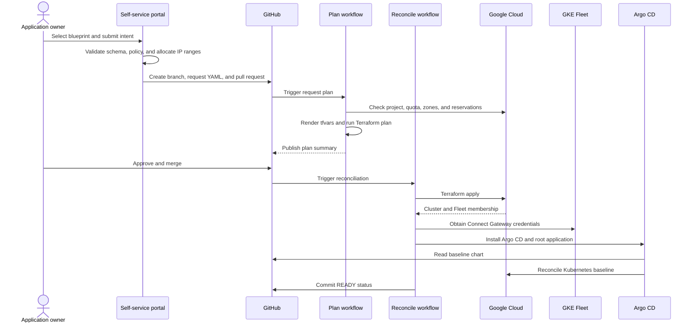

# Architecture

## Goal

The factory turns a small, policy-constrained request into a repeatable GKE platform instance. The design separates application intent from platform implementation so every cluster is created through the same audited path.

## Control flow



## Components

### Portal and API

The FastAPI service exposes:

- `GET /healthz`
- `GET /readyz`
- `GET /api/v1/catalog`
- `POST /api/v1/requests/validate`
- `POST /api/v1/requests`
- `GET /api/v1/requests`

Local mode writes YAML files directly. GitHub mode creates a branch and pull request. The production Cloud Run service is protected by IAP, and the API records the authenticated email provided by IAP.

### Blueprint catalog

`config/profiles.yaml` is the platform product catalog. It controls regions, zone defaults, machine types, capacity profiles, backup defaults, and allowed GPU combinations.

A request can override only fields exposed by the request contract. Validation rejects a request that conflicts with the selected blueprint.

### IP address management

`config/ipam.yaml` defines non-overlapping supernets. The API scans committed requests and allocates the first available child range for nodes, Pods, Services, and control planes. Resource names include a stable hash of the cluster name. The resolved values are stored in the request record so plans are deterministic.

Repository-wide validation rejects duplicate cluster names, duplicate project IDs, duplicate subnet or secondary-range names, and overlapping allocations. Branch protection must require pull requests to be current before merge, so a second concurrent request is revalidated after the first one merges. For a larger organization or very high request concurrency, replace the file-backed allocator with an enterprise IPAM transaction or a dedicated allocation service. The interface boundary is `app/ipam.py`.

### Git approval model

The YAML request is desired state. A pull request provides:

- a human-readable change record
- CODEOWNERS approval
- schema and policy checks
- live cloud preflight
- Terraform plan output
- branch protection
- a merge event that starts reconciliation

Protected GitHub environments provide a second control for production apply and destruction.

### Terraform roots

`terraform/bootstrap` creates shared factory prerequisites:

- optional platform project
- versioned GCS Terraform state bucket
- immutable Artifact Registry repository
- Secret Manager secret for the portal GitHub credential
- CI service account
- GitHub Workload Identity pool and provider
- project, folder, billing, and Shared VPC permissions

`terraform/factory-app` creates:

- dedicated Cloud Run runtime service account
- Secret Manager access
- Cloud Run v2 service
- direct Cloud Run IAP
- IAP access for the approved portal group

`terraform/cluster` creates or uses a service project and composes the network, GKE, and backup modules.

### Network module

Dedicated VPC mode creates a VPC, subnet, secondary ranges, Private Google Access, router, and optional Cloud NAT.

Shared VPC mode consumes a host project and attaches the service project. Organizations that centrally own subnets, routers, NAT, firewall rules, and DNS should adapt this module to reference those resources instead of creating duplicates.

### GKE module

The GKE module creates:

- regional GKE Standard cluster
- private nodes and optionally a private-only control plane endpoint
- VPC-native Pod and Service ranges
- Dataplane V2
- Workload Identity Federation for GKE
- Google Groups authentication
- CMEK for Kubernetes secrets
- Binary Authorization evaluation mode
- release channel and maintenance window
- logging, monitoring, Managed Service for Prometheus, and datapath observability
- Fleet registration
- least-privilege node service account
- system and general CPU pools
- optional isolated H100 pool

The system and general pools are spread across three zones and use autoscaling, auto-repair, auto-upgrade, Container-Optimized OS, Shielded VM controls, gVNIC, and GKE metadata mode.

The H100 pool is tainted with `nvidia.com/gpu=present:NoSchedule` and labeled for explicit workload placement. Reservation affinity is used when the request selects reservation provisioning.

### Backup module

Backup for GKE is configured from the selected tier. The plan can include volume data and secrets, uses a target RPO schedule, applies retention and delete-lock settings, and encrypts backups with the cluster KMS key.

### Fleet and GitOps

The apply workflow retrieves credentials through the Fleet Connect Gateway. This avoids adding a public cluster endpoint merely for CI.

`bootstrap_cluster.sh` installs Argo CD and creates a root application. Argo CD then reconciles `gitops/charts/platform-baseline`.

The baseline creates:

- team and platform namespaces
- owner and platform administrator RBAC
- default-deny network policies with required platform egress
- resource quotas and limits
- required metadata labels
- Pod hardening policies
- image digest and registry policies
- production availability policy
- Service exposure policy
- restricted Argo CD AppProject source scope

## Trust boundaries

```text
Browser identity -> IAP -> portal runtime identity -> GitHub repository
GitHub OIDC -> Workload Identity Federation -> CI service account -> GCP
Fleet Connect Gateway -> Kubernetes API -> Argo CD -> approved Git path
Application Google Group -> Connect Gateway and namespace RBAC
Platform Google Group -> Connect Gateway and cluster-admin RBAC
```

No long-lived Google Cloud service-account key is part of the normal path.

## State and reconciliation

Each cluster has an independent GCS backend prefix:

```text
gke-clusters/<cluster-name>
```

The portal uses another prefix:

```text
platform/factory-app
```

The request file carries user intent, resolved IP allocation, lifecycle phase, and conditions. Terraform state remains the authoritative mapping to cloud resource IDs. Argo CD remains authoritative for the Kubernetes baseline.

## Failure handling

- Validation failure blocks submission.
- Cloud preflight failure blocks plan and apply.
- Terraform plan failure blocks approval.
- Terraform or GitOps reconciliation failure records `FAILED` in the request and leaves the resources in place for diagnosis.
- A request is marked `READY` only after nodes are ready and the Argo CD baseline is both `Synced` and `Healthy`.
- Destruction is a separate manual workflow with an exact confirmation string and protected environment.

## Extension points

- Replace GitHub with GitLab by implementing the repository interface.
- Replace file IPAM with an enterprise IPAM API.
- Add more regions through versioned blueprints and IP pools.
- Add a multi-region blueprint with two cluster states and global traffic management.
- Add cost estimation during pull requests.
- Add organization-specific attestors and image signing.
- Add ServiceNow or Backstage as a front end while keeping the request API.
